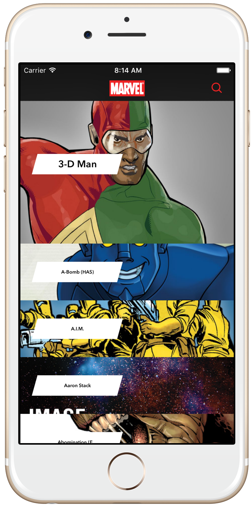
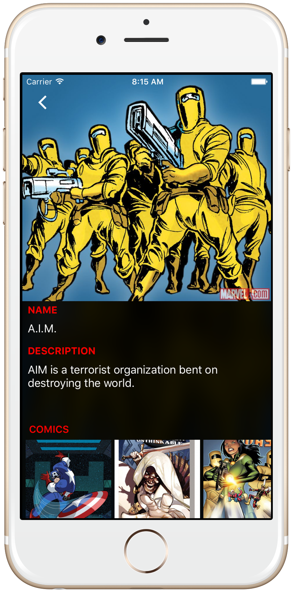

Marvel
========================

## Overview
iOS Marvel client app enable users to browse Marvel characters. Developed using VIPER and TDD.

## App Description

Using this application, users will be able to browse through the Marvel library of characters. The data is available by connecting to the Marvel API http://developer.marvel.com .

**App use cases**

*List of Characters*:

- In this view, you should present a list of characters loaded from the Marvel API character index. Notice that the when reaching the end of the list, if there are additional results to show, you should load and present the next page.

*Filter Results*:

- When tapping on the magnifier icon, you should be able to search for characters by name. To do this, use the same endpoint used to list characters and use the name param to filter results.

*Character Details*:

- When selecting a character, you should present a detail view of that character. Most of this information is already available on the result of the first API call, except for the images to be presented on the comics/series/stories/events sections. Those images can be fetched from the resourceURI and should be lazy loaded. That same behaviour is expected when expanding those images.

## Installation

Just clone the repo or download it in zip-file, Open the project in Xcode then test it on your iOS device or iOS simulator.

In case you want to change the project setup like Marvel API keys:

* Get your own keys from http://developer.marvel.com
* Inside Marvel/Marvel/AppConstants, change `KMarvelFactory_PublicKey` and `KMarvelFactory_PrivateKey` with your owen keys.
