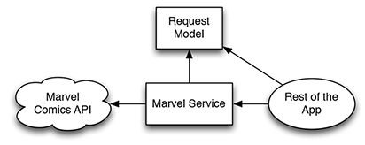

Marvel
========================

[](https://developer.apple.com/iphone/index.action)
[](https://developer.apple.com/swift)
[](http://mit-license.org)

## Overview
iOS Marvel client app enable users to browse Marvel characters. Developed using VIPER and TDD.


## App Description

Using this application, users will be able to browse through the Marvel library of characters. The data is available by connecting to the Marvel API http://developer.marvel.com .

**App use cases**

*List of Characters*:

- In this view, you should present a list of characters loaded from the Marvel API character index. Notice that the when reaching the end of the list, if there are additional results to show, you should load and present the next page.

*Filter Results*:

- When tapping on the magnifier icon, you should be able to search for characters by name. To do this, use the same endpoint used to list characters and use the name param to filter results.

*Character Details*:

- When selecting a character, you should present a detail view of that character. Most of this information is already available on the result of the first API call, except for the images to be presented on the comics/series/stories/events sections. Those images can be fetched from the resourceURI and should be lazy loaded. That same behaviour is expected when expanding those images.


## Installation

Just clone the repo or download it in zip-file, Open the project in Xcode then test it on your iOS device or iOS simulator.

In case you want to change the project setup like Marvel API keys:

* Get your own keys from http://developer.marvel.com
* Inside Marvel/Marvel/AppConstants, change `KMarvelFactory_PublicKey` and `KMarvelFactory_PrivateKey` with your owen keys.


# Xcode Project files structure
```bash
.swift
+-- AppDependencies
|   +-- AppDependencies.swift
+-- Common
|   +-- RootWireframe.swift
+-- AppDelegate
|   +-- AppDelegate.swift
+-- Storyboards
|   +-- Main.storyboard
|   +-- LaunchScreen.storyboard
+-- Extensions
|   +-- UIColor+Palette.swift
|   +-- UIImage+Decompression.swift
|   +-- UIImageEffects.swift
|   +-- String+UppercaseFirst.swift
+-- Models
|   +-- Catalog.swift
|   +-- Character Events
|   +-- Character Stories
|   +-- Charachter Series
|   +-- CharachterComics
|   +-- Charachter
+-- Assets
|   +-- Assets.xcassets
+-- Utility
|   +-- AppConstants
    |   +-- AppConstants
        |   +-- AppConstants.swift
+-- Marvel Base
|   +-- Networking
    |   +-- Factory
        |   +-- MarvelFactory.swift
        |   +-- MarvelFactory+Comics.swift
        |   +-- MarvelFactory+Series.swift
        |   +-- MarvelFactory+Story.swift
        |   +-- MarvelFactory+Events.swift
    |   +-- Client
        |   +-- Networking.swift
    |   +-- MarvelGateway.swift
+-- Modules
|   +-- List Characters
    |   +-- Application Logic
        |   +-- ListInteractor.swift
        |   +-- ListInteractorIO.swift
    |   +-- Module Interface
        |   +-- ListModuleInterface.swift
    |   +-- User Interface
        |   +-- Presenter
            |   +-- ListPresenter.swift
        |   +-- View
            |   +-- ListCharactersViewController.swift
            |   +-- SlidingMenuCell.swift
            |   +-- SlidingMenuLayout.swift
            |   +-- ListViewInterface.swift
        |   +-- Wireframe
            |   +-- ListWireframe.swift
|   +-- Filter Characters
    |   +-- Application Logic
        |   +-- FilterInteractor.swift
        |   +-- FilterInteractorIO.swift
    |   +-- Module Interface
        |   +-- FilterModuleInterface.swift
    |   +-- User Interface
        |   +-- Presenter
            |   +-- FilterPresenter.swift
        |   +-- View
            |   +-- FilterCharactersTableViewController.swift
            |   +-- FilterTableViewCell.swift
            |   +-- FilterViewInterface.swift
        |   +-- Wireframe
            |   +-- FilterWireframe.swift
|   +-- Characters Details
    |   +-- Application Logic
        |   +-- DetailsInteractor.swift
        |   +-- DetailsInteractorIO.swift
    |   +-- Module Interface
        |   +-- DetailsModuleInterface.swift
    |   +-- User Interface
        |   +-- Presenter
            |   +-- DetailsPresenter.swift
        |   +-- View
            |   +-- Parallex Transition
                |   +-- ParallaxTableViewController.swift
            |   +-- MarvelHeroesDetailsTableViewController.swift
            |   +-- CategoryRow.swift
            |   +-- CharacterSectionCollectionViewCell.swift
            |   +-- CharacterDetailsTopCellTableViewCell
            |   +-- RelatedLinksTableViewCell.swift
            |   +-- FooterReusableView.swift
            |   +-- CounterView.swift
            |   +-- DetailsViewInterface.swift
        |   +-- Wireframe
            |   +-- DetailsWireframe.swift
            
.swift tests
+-- MarvelAuthenticationTests.swift 
+-- Interactor
|   +-- ListInteractorTests.swift
|   +-- FilterInteractorTests.swift
|   +-- DetailsInteractorTests.swift
+-- Presenter
|   +-- ListPresenterTests.swift
|   +-- FilterPresenterTests.swift
|   +-- DetailsPresenterTests.swift
+-- ViewController
|   +-- ListViewTests.swift
```

**AppDependencies** : Contains the code that is responsible for VIPER's module configuration.

**Common** : Contains common behavior between VIPER modules like RootWireframe, all modules wireframes use this RootWireframe.

**Extensions** : Contains different Extensions like Color and image extension.

**Models** : Contains App Model layer.

**Assets** : Contains all resources like images used in the App.

**Utility** : Contains app utility classes like AppConstants that is a shared constant class between all classes.

**Marvel Base** : Is the core engine of the project. It contain the Networking logic (Networking.swift), `MarvelGateway.swift` that is implemented to acheive the Dependency Inversion Principle between networking logic and the rest of the App. And `MarvelFactory.swift` that implement/adopt to `MarvelGateway.swift` and finally the app dealing with it to get data from te network.

**Modules** : Contains all VIPER Architecture design patterns modules. Every module has it's owen layer/components like Interactor, Presenter, View, Entity, Routing a.k.a (Wireframe).

**MarvelTests** : Contains all unit testing files like testing VIPER modules and MarvelAuthenticationTests.


# Design Patterns used:

**Dependency inversion principle — the D of SOLID.** 

In object-oriented programming, the dependency inversion principle refers to a specific form of decoupling software modules. 
As Objects are like horses. The less they know about their chaotic surroundings, the easier it is to control them.
We don’t want our objects to be spooked when there’s a lot going on. So let’s build ignorance into our systems.

I used this techniqe in the network layer:

The classic way to invert a dependency is to extract a protocol. (If you’re an Android developer, when you see “protocol,” think “interface.”) We’ll call it the Marvel Gateway. In the following diagram, it’s marked with <P> to show that it’s a protocol:



To make our API service layer more ignorant about most of the app, it has to implement the marvel gateway protocol. The prtocol act as a contract.
Thanks to Dependency Inversion, the rest of the app can now be ignorant. It knows about the contract, but not about any class that satisfies that contract.
Anything that implements the protocol can be plugged in. The Marvel Gateway serves as a Boundary.


